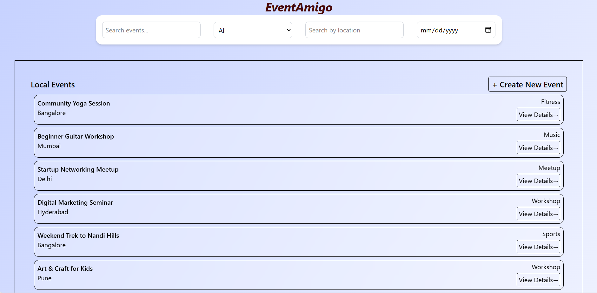
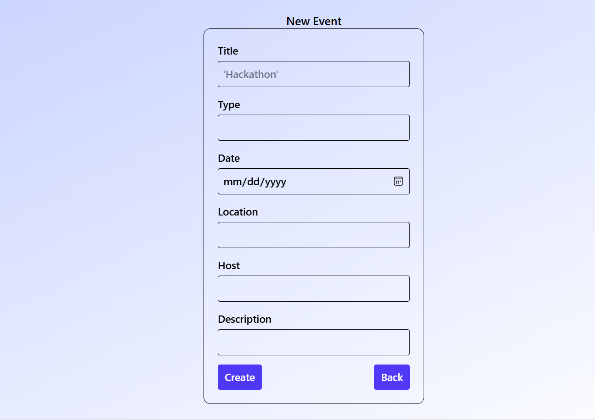
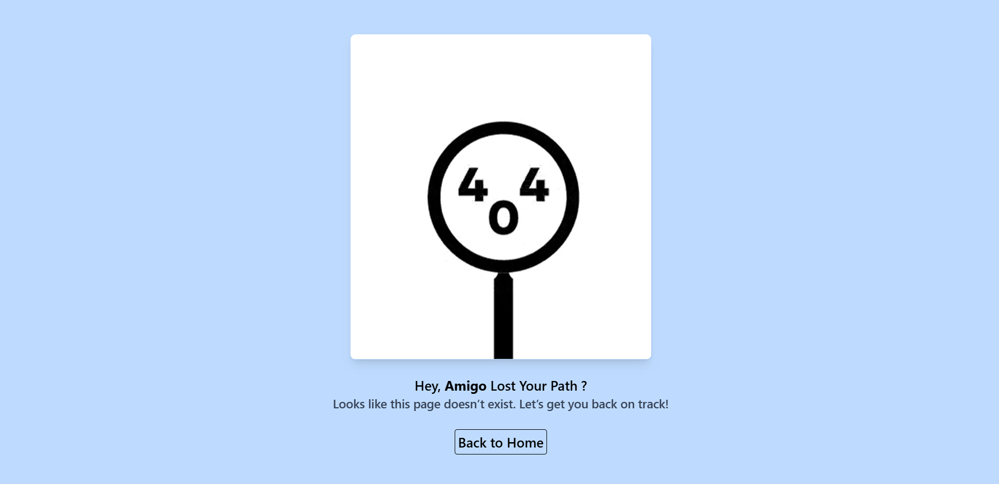

# 🎉 EventAmigo - Event Management App

EventAmigo is a simple event listing and management application built with **React, TailwindCSS, and Framer Motion**.  
You can view local events, filter them by type, location, or date, and create new events easily.

---

## 🚀 Features
- 🔍 Search and filter events by title, type, location, and date
- 🗓️ Restrict users to choose only **future dates**
- 🎨 Modern responsive UI with **TailwindCSS**
- ⚡ Smooth animations with **Framer Motion**
- 📱 Mobile-first and responsive design
- ➕ Create new events easily

---

## 📦 Installation

1. **Clone this repository**  
```bash
git clone https://github.com/your-username/eventamigo.git
cd starlabs
```
2. **Install Dependencies**
```bash
npm install
```
3. **Run the development server**
```bash
npm run dev
```
4. **Open your browser**
+ Visit: [http://localhost:5173](http://localhost:5173)

## 📸 Screenshots

### 🏠 Home Page


### 🎉 Event Form


## 🚧 404 Not Found Page

The app includes a **custom 404 page** for routes that don’t exist, helping users easily navigate back home.



## 🛠️ Tech Stack
- React (Frontend)
- Vite (Build tool)
- TailwindCSS (Styling)
- Framer Motion (Animations)
- Context API (State Management)

